# InternShield

AI-powered internship URL trust analyzer that helps students identify potentially suspicious internship and job application links before applying.

## Live Demo

Frontend:
https://intern-shield-nu.vercel.app

Backend API:
https://internshield-hmt2.onrender.com

---

## Problem Statement

Students frequently receive internship opportunities through social media, WhatsApp groups, Telegram channels, emails, and job boards.

Many of these links may lead to phishing websites, fake application portals, or scam recruitment pages.

InternShield analyzes internship URLs and provides a trust score using multiple security signals to help users make safer decisions.

---

## Features

- URL Trust Score (0–100)
- Domain Age Analysis
- Google Safe Browsing Checks
- Redirect Detection
- HTTPS Verification
- Company Domain Verification
- Risk Indicator Detection
- Security Overview Dashboard
- Live Threat Intelligence Report

---

## Tech Stack

### Frontend
- React
- Vite
- React Router
- Framer Motion

### Backend
- Node.js
- Express.js

### APIs
- WHOIS API
- Google Safe Browsing API

### Deployment
- Vercel (Frontend)
- Render (Backend)

---

## System Architecture

User → React Frontend (Vercel)

↓

Express Backend API (Render)

↓

WHOIS API + Google Safe Browsing API

↓

Trust Analysis Engine

↓

Trust Score + Risk Assessment Report

---

## How It Works

1. User enters an internship URL.
2. Backend analyzes domain information.
3. WHOIS data is used to estimate domain age.
4. Redirect behavior is inspected.
5. Google Safe Browsing checks are performed.
6. Security signals are combined.
7. A trust score and risk report are generated.

---

## Screenshots

### Landing Page

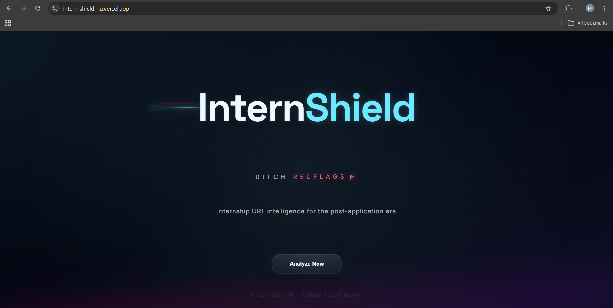

### Scanner Dashboard

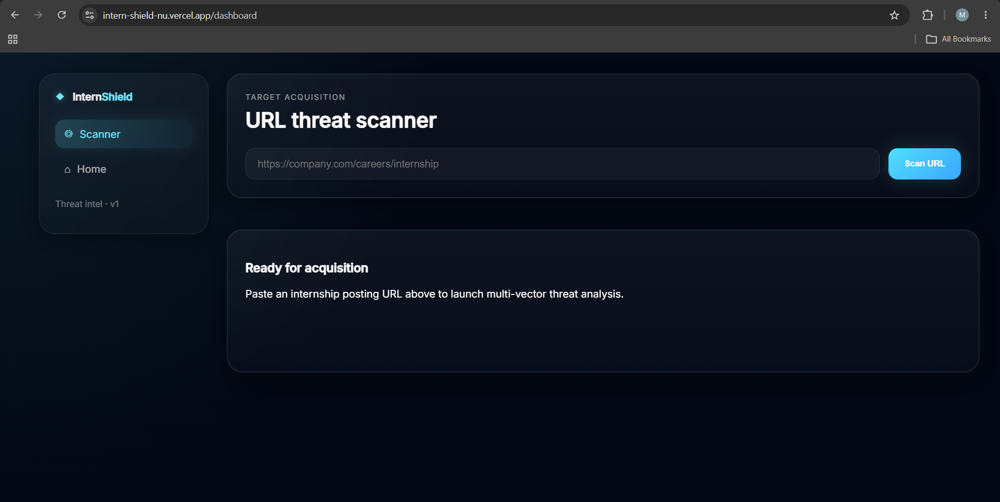

### URL Analysis Loading State

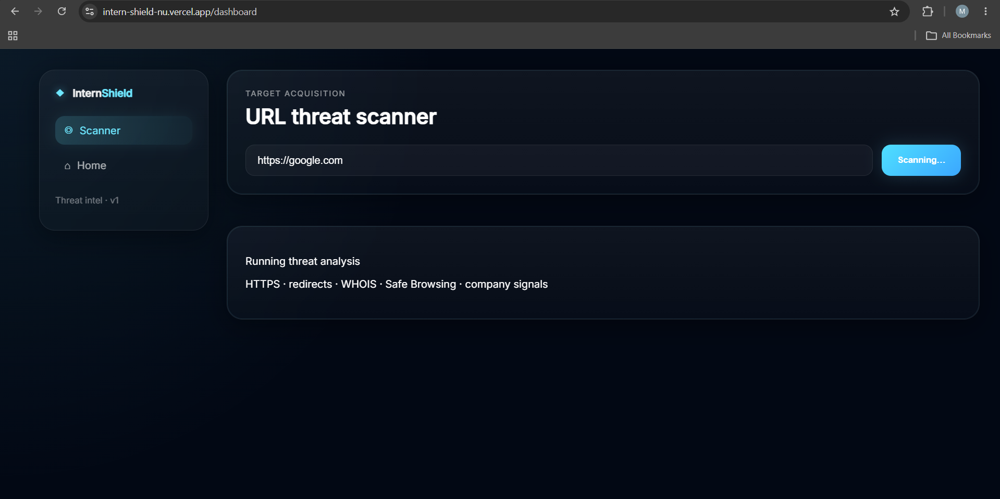

### Trusted Website Analysis (Google)

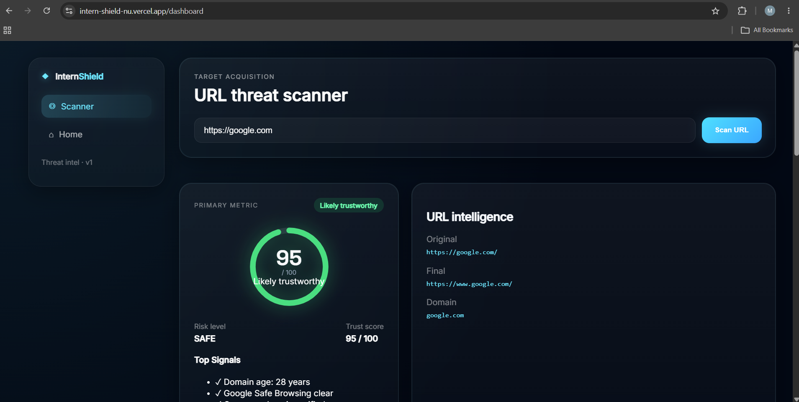

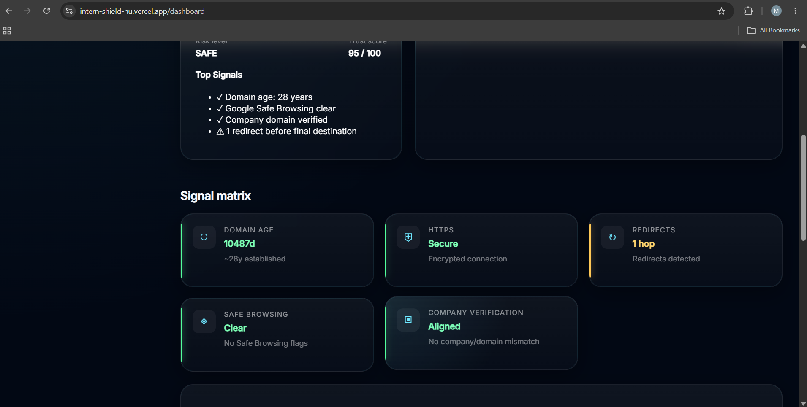

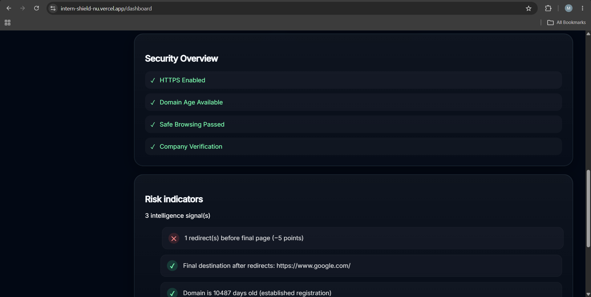

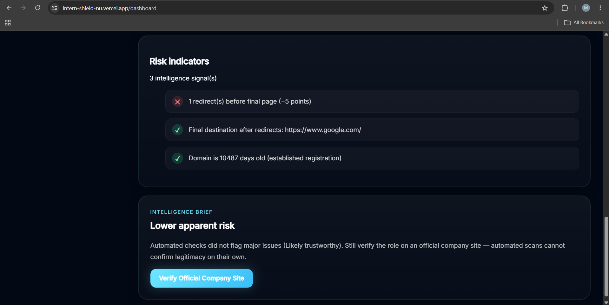

### Suspicious Internship Domain Analysis

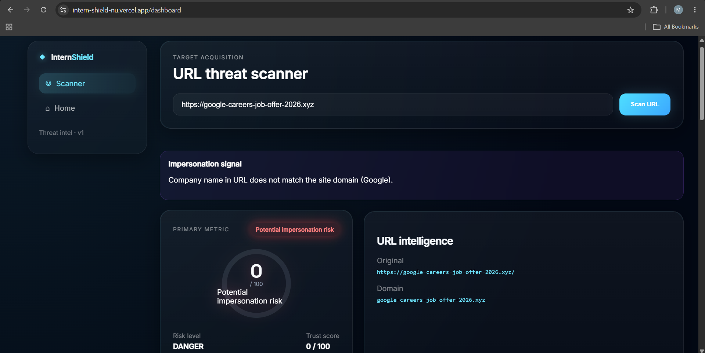

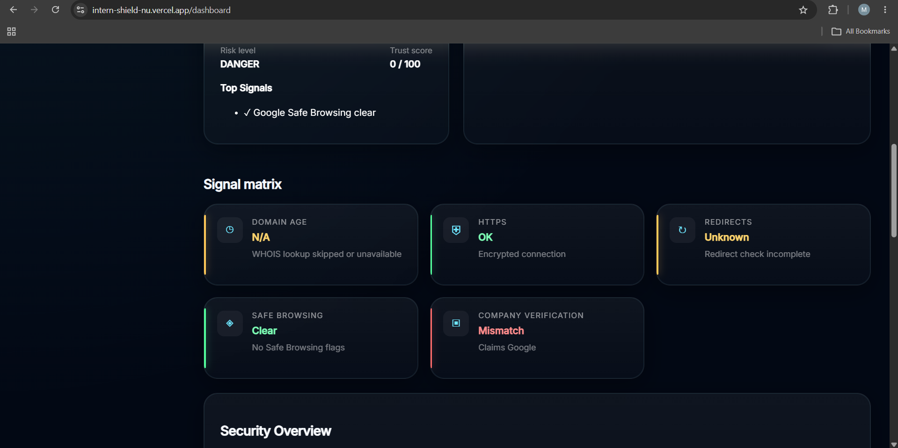

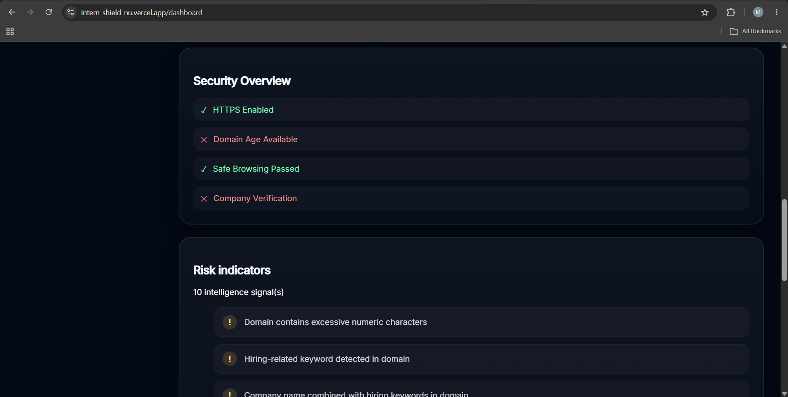

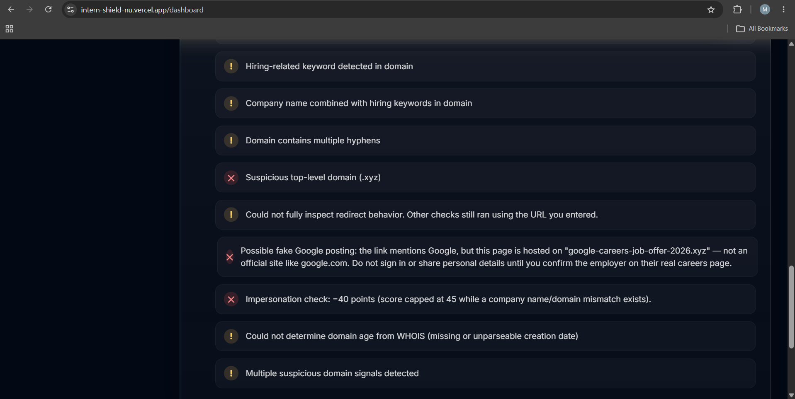

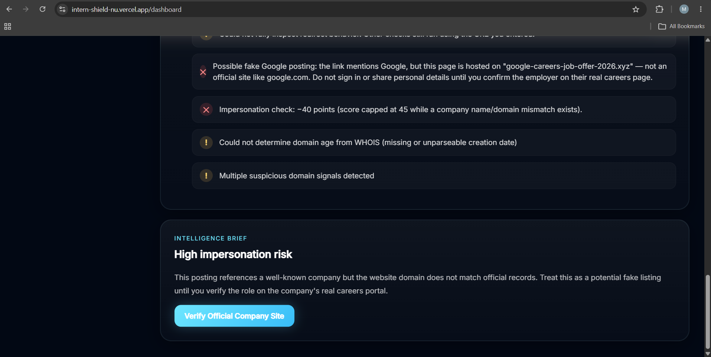

---

## Example Test Cases

### Trusted Domain

URL:
https://google.com

Result:
- Trust Score: 95/100
- HTTPS Enabled
- Domain Age: 28 Years
- Safe Browsing Passed

### Suspicious Internship Domain

URL:
https://google-careers-job-offer-2026.xyz

Result:
- Suspicious naming pattern detected
- Risk indicators triggered
- Lower trust score

### Random Unknown Domain

URL:
https://asdkjhasdkjh123123.com

Result:
- Domain age unavailable
- Inspection limitations detected
- Suspicious domain structure

---

## Future Improvements

- Machine Learning Based URL Classification
- Blacklist Database Integration
- Browser Extension
- Real-Time Phishing Detection
- Screenshot Analysis of Career Pages

---

## Author

Dharani Paladugula

GitHub:
https://github.com/dharanipaladugula
