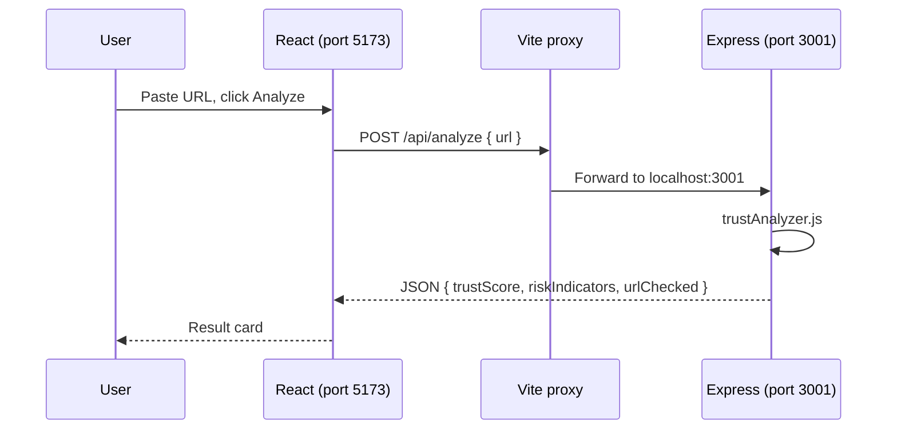

# InternShield — Student Internship Trust Analyzer

A small **full-stack** demo: paste an internship URL, click **Analyze**, and see a **trust score** plus **risk indicators**.

This project is intentionally simple so beginners can read every file and understand how frontend and backend connect.

---

## Project structure

```
Internsheild/
├── README.md                 ← You are here — overview and how to run
├── .gitignore                ← Tells Git to ignore node_modules, build output, etc.
│
├── backend/                  ← Node.js + Express API
│   ├── package.json          ← Backend dependencies and npm scripts
│   ├── server.js             ← Starts the web server and defines API routes
│   └── trustAnalyzer.js      ← Core logic: HTTPS + keyword checks (no Express)
│
└── frontend/                 ← React app (Vite)
    ├── package.json          ← Frontend dependencies and npm scripts
    ├── vite.config.js        ← Dev server + proxy to backend
    ├── index.html            ← Single HTML page; React mounts into #root
    └── src/
        ├── main.jsx          ← React entry: renders <App />
        ├── App.jsx           ← UI: input, button, result card, API call
        ├── App.css           ← Styles for the app component
        └── index.css         ← Global page styles
```

---

## What each file does

### Root

| File | Purpose |
|------|---------|
| **README.md** | Documentation, setup steps, and file-by-file explanation. |
| **.gitignore** | Excludes `node_modules/`, build folders, and secrets from version control. |

### Backend (`backend/`)

| File | Purpose |
|------|---------|
| **package.json** | Lists `express` and `cors`. Scripts: `npm start` runs the server; `npm run dev` runs with auto-restart on file changes (Node 18+). |
| **server.js** | Creates the Express app on port **3001**. Enables JSON body parsing and CORS. Exposes `POST /api/analyze` with body `{ "url": "..." }` and `GET /api/health`. |
| **trustAnalyzer.js** | **Business logic only** (easy to test). Parses the URL, checks HTTPS, scans for suspicious keywords (e.g. "registration fee", "wire transfer"), adjusts a 0–100 trust score, returns `{ trustScore, riskIndicators, urlChecked }`. |

### Frontend (`frontend/`)

| File | Purpose |
|------|---------|
| **package.json** | Lists `react`, `react-dom`, and `vite`. Script `npm run dev` starts the dev UI. |
| **vite.config.js** | Bundles React. In dev, requests to `/api/*` are **proxied** to `http://localhost:3001` so the browser does not hit CORS issues. |
| **index.html** | Shell page with `<div id="root">` and a script tag loading `main.jsx`. |
| **src/main.jsx** | Boots React and renders `<App />` into `#root`. |
| **src/App.jsx** | Form with URL input and **Analyze** button. Calls `POST /api/analyze`, shows loading/error, displays result card with score and bullet list. |
| **src/App.css** | Component layout: form, cards, trust badge colors. |
| **src/index.css** | Global font and dark background. |

---

## How frontend and backend talk



---

## Trust score logic (beginner summary)

- Start at **100**.
- **−25** if the URL is not `https://`.
- **−15 per matched suspicious keyword** (capped at −50 total for keywords).
- Extra small penalties for IP-based hosts or very long subdomain chains.
- Score is clamped between **0** and **100**.

Risk indicators are human-readable strings explaining what was found.

> **Note:** This demo only inspects the **URL text**, not the full webpage. Real products would also fetch the page, check domain age, company registry, etc.

---

## Prerequisites

- [Node.js](https://nodejs.org/) **18 or newer** (for `npm` and optional `node --watch`)

---

## Run locally

Open **two terminals**.

### Terminal 1 — Backend

```bash
cd backend
npm install
npm start
```

You should see: `InternShield backend listening on http://localhost:3001`

Test: open http://localhost:3001/api/health in a browser.

### Terminal 2 — Frontend

```bash
cd frontend
npm install
npm run dev
```

Open the URL Vite prints (usually http://localhost:5173).

### Try these URLs

| URL | Expected |
|-----|----------|
| `https://careers.google.com` | Higher score, HTTPS OK |
| `http://example.com/internship` | HTTPS warning |
| `https://fake.com/registration-fee-intern` | Keyword warnings |

---

## API reference

**POST** `/api/analyze`

Request:

```json
{
  "url": "https://company.com/jobs/intern"
}
```

Response:

```json
{
  "trustScore": 85,
  "riskIndicators": ["No major red flags detected from URL checks alone"],
  "urlChecked": "https://company.com/jobs/intern"
}
```

---

## Next steps (ideas to learn more)

- Add unit tests for `trustAnalyzer.js` with Node’s built-in test runner.
- Fetch page title/meta with a server-side HTTP request (careful with security).
- Store past analyses in a simple JSON file or SQLite database.
- Deploy backend and frontend separately (Render, Railway, Vercel, etc.).

---

## License

MIT — use freely for learning and class projects.
